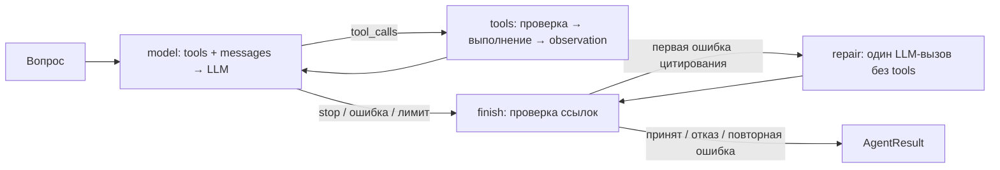

# Стадия 8 — один агент и типизированные вызовы инструментов

## Зачем агент

Обычный RAG всегда выполняет поиск → упаковку контекста → генерацию. Агент выбирает
следующее действие после каждого наблюдения. Например: найти описание метода,
получить числа из документа, вызвать калькулятор, затем ответить со ссылками.
Для простого документного вопроса прежний `/query` остаётся более предсказуемым:
агент добавляет модельные вызовы, стоимость и дополнительные способы ошибиться.

Варианты: собственный `while`; готовая фабрика агента; явный StateGraph. Выбран
последний вариант: LangGraph управляет узлами и переходами, а выбор инструментов,
HTTP-протокол, проверки, бюджеты и финализация видны в нашем коде. Не используем
готовые `create_agent`/ToolNode, LangChain model wrappers или `langchain-openai`.
LangGraph 1.2.11 зафиксирован в uv.lock; его зависимости включают langchain-core,
LangSmith/SDK и prebuilt-пакет, но облачные сервисы проектом не настраиваются.



Состояние одного запуска: сообщения, разобранные ответы LLM, число попыток LLM,
наблюдения инструментов, стабильный реестр источников и результат. Состояние
создаётся заново для каждого запроса; граф общий, история не общая. Переходы
последовательные, поэтому узлы возвращают обновлённые поля без append-reducer.
Нет долговечной памяти, checkpointer, возобновления после рестарта или multi-agent.

## Вызов инструментов в протоколе

Модель получает JSON Schema трёх функций в поле `tools`, `tool_choice=auto`,
`parallel_tool_calls=false`. При решении вызвать инструмент она возвращает
`finish_reason=tool_calls` и `{id, type: function, function: {name, arguments}}`.
`arguments` — строка JSON; приложение разбирает её строгой Pydantic-схемой.
Имя выбирается только из реестра. Текст модели не исполняется как Python или SQL.

В историю добавляются исходное assistant-сообщение с вызовами и по одному
`role=tool` сообщению с соответствующим `tool_call_id`. Следующий запрос LLM видит
полученное наблюдение. Это цикл model → action → observation → model.
Адаптер допускает до четырёх вызовов в ответе, если сервер игнорирует запрет
параллельности; исполняет их последовательно. Повтор ID в истории — ошибка протокола.
`length`, неизвестный finish, неверная схема и несогласованные calls/finish не принимаются.
Reasoning не сохраняется в сообщениях/результате; сохраняется только число символов.

## Инструменты

| Имя | Вход | Выход и ограничения |
| --- | --- | --- |
| `search_documents` | query до 2000 символов, k 1–10 | Существующий серверный BM25/dense/hybrid и reranking; канонические passages с UUID/версией/координатами. Учитываются сначала RAG-бюджет упаковки, затем бюджет observation |
| `calculate` | expression до 256 символов | Decimal с точностью 28 цифр; числа, скобки, + − * /. AST не более 64 узлов; порядок ненулевого значения от −100 до 100. Нет eval/exec, функций, имён, степеней или произвольного кода |
| `document_catalog` | title_contains до 200 символов, limit 1–20, offset 0–10000 | Только текущие версии: ID документа/версии, URI, заголовок, media_type, число чанков. Фиксированный параметризованный SQLAlchemy SELECT, стабильный порядок по document_id |

Фильтр каталога — буквальная регистрозависимая подстрока: `%` и `_` не становятся
wildcard. `has_more` означает наличие следующей страницы, не общее число документов.
Снимок каждой страницы читается отдельно; изменения корпуса между вызовами могут
сдвигать offset-пагинацию. Каталог не требует готовности векторов. Инструменты только
читают; агент не загружает документы и не выполняет сетевые URL/файловые команды.

Результат каждого вызова — Observation с call_id, name, status, data или безопасным
кодом error. Чувствительный текст ошибок драйвера/провайдера не возвращается.
Успешный повтор с теми же валидированными аргументами получает cached=true и
сохранённое наблюдение того же запуска. Это повторное использование снимка, а не
новый запрос к актуальному корпусу. Ошибочный вызов модель может повторить один раз
с теми же валидированными аргументами; затем retry_exhausted. Исправленные аргументы
считаются новым вызовом, но ограничены общим бюджетом. Ошибки схемы не вызывают tool.
Автоматического HTTP retry платной генерации и retry-policy узлов нет.

## Ответы, ссылки и ограничения доказательности

`POST /agent` принимает только `{"query":"..."}`. Ответ обычный JSON, без SSE.
`status`: answered / insufficient_evidence / limit_reached / failed.
`basis=model` означает прямой ответ без инструментов; это непроверенное знание модели.
`basis=tools` означает, что были наблюдения инструментов, а не что все утверждения
семантически подтверждены. Сохраняются observations, model_calls, tool_calls,
completions со статистикой (их text намеренно пуст), citations и tool_references.
`citation_failures` хранит ошибки цитирования с номером модельного вызова;
`repair_attempts` показывает число фактически начатых попыток исправления (0 или 1).
Поэтому успешное исправление не скрывает первую ошибку.

Тексты источников получают стабильные [C1], [C2]… на весь запуск. Один chunk_id
не получает новый номер при повторном поиске. Полный snapshot текста сохраняется.
Калькулятор и каталог получают [T1], [T2]… по номеру наблюдения. Сам вызов поиска
не получает T-ссылку, так как доказательства — найденные passages. Финальная проверка
отклоняет неизвестные, объединённые и отсутствующие ссылки после использования
инструментов. Ошибки инструментов не могут быть источниками. Точное
`INSUFFICIENT_EVIDENCE` — явный отказ, даже при наличии некоторых наблюдений.
Прямой ответ не может ссылаться на несуществующие C/T. Ссылки проверяются на синтаксис
и принадлежность предоставленным данным; их семантическая поддержка не доказана.
Prompt о недоверенных источниках не гарантирует защиты от prompt injection.

Перед исполнением пакета агент проверяет, что аргументы каждого вызова — JSON-объект
без NaN/Infinity. При ошибке весь пакет остаётся неисполненным: повреждённый вызов
получает `invalid_arguments`, остальные — `batch_rejected`. Исходное предложение
сохраняется текстом в assistant history, чтобы некорректные аргументы не отправлялись
снова через native tool_calls. Системное сообщение просит модель сформировать новые
вызовы. Приложение не достраивает скобки и не подставляет аргументы для исполнения.
Повторы расходуют общие model/tool/prompt бюджеты и deadline; отклонённые предложения
тоже учитываются в tool_calls. Этот путь проверен локальными тестами, включая HTTP
с подставным провайдером. В одном реальном продолжении сохранённого диалога провайдер
принял новую историю (HTTP 200), но Qwen выбрал ответ по первой странице вместо
исправленного tool call. Ответ не содержал [T1]; попытка исправления цитат повторила
тот же текст. API отклонил его с `invalid_citations`. Это подтверждает приём истории,
но не успешное исправление аргументов моделью. Отчёт:
`artifacts/agent_arguments_controlled_20260918_v1/`.

При первой ошибке структурной проверки цитат агент делает максимум одну попытку
исправления финального текста. В историю добавляется системное сообщение об ошибке
с доступными C/T идентификаторами; прежний текст и наблюдения остаются в истории.
Валидатор и repair используют общий расчёт причин ошибки: отсутствие маркеров после
tools, неправильный/групповой формат, неизвестные ID. Repair получает конкретные
причины и описание типа каждого доступного доказательства: passage, страница каталога
или результат вычисления. Текст источников и названия документов не переносятся в
system-инструкцию. Модели предлагается сопоставить тезисы с наблюдениями, поставить
ссылки рядом с подтверждёнными утверждениями и удалить неподтверждённые. Для каталога
явно требуется цитировать подтверждённые пункты списка. При одном реальном повторе
на той же сохранённой истории новая инструкция привела к добавлению единственного
`[T1]` в конец прежнего ответа, после заключительного вопроса. Структурный валидатор
принял ответ, но требование ссылок рядом с пунктами не выполнено. Это ограниченный
успех проверки формата, не доказательство надёжной привязки тезисов к источникам.
Отчёт: `artifacts/agent_specific_repair_20260918_v1/`.
Отправляется `tool_choice=none` без новых tool definitions. Если провайдер всё же
возвращает tool calls, агент завершает запрос с `repair_requested_tools` и ничего
не исполняет. Повторная ошибка цитат даёт `invalid_citations`; допустим и явный отказ
`INSUFFICIENT_EVIDENCE`. Автоматического добавления ссылок приложением нет.

Исправление расходует один из общих model_calls, прежний output budget и общий API
deadline. Проверяется полная история с сообщением об ошибке. При нехватке бюджета
новый вызов не делается, возвращается limit_reached с сохранённой citation_failures.
Это новая генерация после конкретной ошибки валидации, не повтор HTTP-запроса при
сетевом сбое. Сетевые ошибки/таймаут исправления не запускают ещё одну попытку.
Структурно корректная выдуманная библиография этой проверкой не обнаруживается:
данный механизм не является семантической проверкой. Ветка проверена тестами и одним
реальным вызовом Qwen: начало диалога с исходным ответом без ссылок и каталог были
воспроизведены из сохранённого отчёта; новая генерация добавила [T1] и прошла проверку.
Свежий запрос каталога отдельно завершился до repair: некорректный JSON аргументов,
затем HTTP 400 провайдера. Поэтому это подтверждение одного контролируемого
исправления, а не оценка надёжности полного сценария или частоты успешного repair.

Модель может выбрать неправильный инструмент или необоснованно ответить прямо.
Эта стадия тестирует инфраструктуру, а не измеряет tool-selection accuracy или
качество ответов настоящей модели. Agent evaluation остаётся стадией 10.

## Бюджеты и отмена

По умолчанию: 6 модельных вызовов, 8 tool observations (ошибки и cache hits тоже
считаются), 48000 UTF-8 байт messages+tool schemas, 12000 байт на observation.
Запросы ограничены 8000 символами. Перед каждым вызовом LLM проверяется вся история;
автоматического обрезания/суммаризации нет. Большие passages пропускаются целиком с
счётчиком skipped. Слишком большой результат каталога возвращает observation_budget.
Лимит байтов не заменяет токенизацию и резерв output контекста serving-модели.

На последнем разрешённом модельном шаге предложенные инструменты не запускаются:
для их интерпретации уже нет следующего LLM-вызова. При превышении бюджета batch
инструментов не выполняется частично. LangGraph recursion_limit — дополнительный
предохранитель, а не основной бюджет. Общий deadline и конкурентность берутся из
API (180 секунд, 8 in-flight по умолчанию), рабочий слот общий с `/query`/ingestion.

Для SQL/поиска AnyIO task group владеет дочерней задачей со shielded thread worker.
Это нужно потому, что LangGraph использует прямую отмену asyncio-задачи узла:
простой CancelScope в самом узле не гарантирует ожидание потока. Выход из task group
дожидается начатой операции. Отмена не запускает следующую генерацию; HTTP ожидание
модели отменяемо. Deadline для начатой синхронной операции остаётся мягким.
Нельзя обещать, что внешний LLM прекратит вычисления/биллинг сразу после disconnect.

HTTP 200: answered/insufficient_evidence; 422: budget limit или неверный запрос;
502: ошибка модели/цитат; 504: таймаут; 503: занятость/недоступность сервиса.
При общем API deadline или disconnect полного AgentResult может не быть.
Статистика LLM доступна только для успешно разобранных ответов; сетевые/неполные
ошибки могут не иметь usage. Это не точный финансовый учёт всех попыток.

## Запуск без платной генерации

```bash
uv sync --locked --extra embeddings
docker compose up -d --wait postgres
uv run --locked --extra embeddings agentic-rag db-upgrade
RAG_API_LLM_PROVIDER=fake uv run --locked --extra embeddings uvicorn \
  agentic_rag.api.app:create_app --factory --host 127.0.0.1 --port 8001
```

Если на порту уже запущен сервер, остановите его Ctrl+C перед новым запуском.
Swagger: http://127.0.0.1:8001/docs → POST /agent → Try it out.

```bash
curl -sS http://127.0.0.1:8001/agent -H 'Content-Type: application/json' \
  -d '{"query":"/calc 6 / 8 * 100"}'
curl -sS http://127.0.0.1:8001/agent -H 'Content-Type: application/json' \
  -d '{"query":"/catalog"}'
curl -sS http://127.0.0.1:8001/agent -H 'Content-Type: application/json' \
  -d '{"query":"/search PagedAttention"}'
curl -sS http://127.0.0.1:8001/agent -H 'Content-Type: application/json' \
  -d '{"query":"/direct"}'
```

Fake — явные демонстрационные команды, не наученная модель. `/calc` реально вызывает
наш калькулятор; `/catalog` читает PostgreSQL; `/search` использует существующий поиск,
но финальный текст — помеченный excerpt. `/direct` выдаёт fixture без инструментов.
Произвольный текст в fake направляется в поиск, не проходит интеллектуальную маршрутизацию.

Для настоящей модели переключите RAG_API_LLM_PROVIDER=compatible и используйте обычный
вопрос, например «Найди описание PagedAttention и объясни, что хранится в KV cache».
Endpoint должен поддерживать Chat Completions `tools`/`tool_calls`. Успешный RAG JSON/SSE
стадии 7 этого не доказывает. Существующие endpoint/model/key/reasoning настройки
сохраняются. Один агентный запрос может вызвать несколько платных генераций.
При реализации стадии 8 платных вызовов не было. Затем по отдельному разрешению
проверены четыре реальных сценария Rus-GPT/Qwen: tools/tool_calls работают, включая
цепочку каталог → калькулятор. Один ответ отклонён из-за отсутствия [T1], ещё один
принят структурно, но содержит выдуманное название статьи. Это smoke-проверка,
а не оценка общей точности; полный разбор в [results.md](results.md).

## Что нужно знать для интервью

- Tool calling — протокол предложений действий; права исполнения принадлежат приложению.
- Deterministic workflow фиксирует маршрут; агент выбирает маршрут по результатам LLM.
- State — данные запуска; nodes — операции; conditional edges — выбор следующего узла.
- Tool errors могут быть наблюдениями для исправления, но не доказательствами ответа.
- Повторы требуют идемпотентности; наш cache/retry относится только к read-only tools.
- Лимиты вызовов, истории и deadline защищают разные ресурсы; recursion_limit их не заменяет.
- Structured arguments и существующая ссылка не доказывают правильность аргументов/ответа.
- Отмена ожидания, завершение потока и отмена внешнего вычисления — разные события.

## Вопросы для самостоятельного ответа

1. Чем выбор действия агентом отличается от обычного RAG workflow, и когда агент избыточен?
2. Что именно генерирует LLM при tool calling, кто исполняет функцию и зачем tool_call_id?
3. Зачем несколько независимых лимитов, если уже есть recursion_limit LangGraph?
4. Что можно повторить после ошибки read-only tool и что изменится для инструмента записи?
5. Почему правильная JSON Schema и существующие [C1]/[T1] не гарантируют правильного ответа?

Источники: [Graph API](https://docs.langchain.com/oss/python/langgraph/graph-api),
[Quickstart с явным циклом](https://docs.langchain.com/oss/python/langgraph/quickstart).
Решение: [ADR 0011](adr/0011-bounded-agent.md). Проверки: [results.md](results.md).
