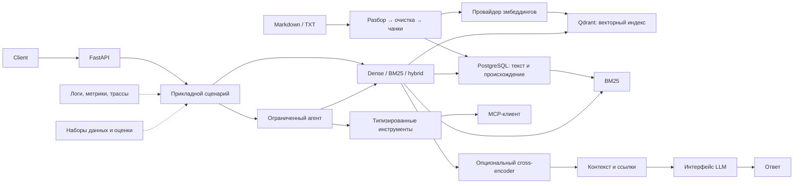

# Архитектура и границы системы

Проект реализован до этапа 14 включительно. Это модульный монолит на Python:
PostgreSQL хранит канонические документы и ревизии, Qdrant — пересобираемый
векторный индекс, а FastAPI предоставляет HTTP-интерфейс. Подтверждённые команды,
версии наборов данных и результаты экспериментов находятся в [журнале результатов](results.md).

## Назначение

Система отвечает на вопросы по технической документации и статьям ML/LLM, связывая
утверждения с проверяемыми фрагментами источников. Ссылка должна содержать документ,
ревизию и координаты чанка; само наличие ссылки ещё не доказывает, что она
подтверждает утверждение.

Реализованы загрузка Markdown/TXT, dense-, BM25- и гибридный поиск, опциональный
cross-encoder, Basic RAG, HTTP API со streaming, один ограниченный агент, MCP,
оценка агента, трассировка и развёртывание Compose. Самостоятельный GPU-инференс
отложен: внешняя совместимая модель используется только как отдельный сервис.

## Схема

`POST /query` всегда выполняет поиск и не требует агента. `POST /agent` запускает
отдельный цикл «модель → инструмент → модель», ограниченный числом шагов,
тайм-аутом и размером истории.

## Правила границ

- Прикладная логика не импортирует FastAPI, SDK Qdrant или конкретный клиент LLM.
  Точки входа собирают зависимости и передают их через небольшие `Protocol`-контракты.
- PostgreSQL — источник истины. В Qdrant записываются только готовые ревизии; индекс
  можно восстановить из канонических чанков.
- Блокирующие операции разбора, эмбеддингов и reranking не выполняются в event loop.
- Тесты используют детерминированные подмены. Реальные LLM-проверки не заменяют
  оценку качества и не должны требовать ключа или GPU.

## Ключевые решения

| Область | Решение | Причина |
| --- | --- | --- |
| Структура | Модульный монолит | Компоненты проще тестировать и объяснять, чем микросервисы без нагрузки. |
| Хранилища | PostgreSQL + Qdrant | Отделяет канонический текст от производного векторного индекса. |
| Поиск | Dense → BM25/RRF → reranking | Позволяет измерить вклад каждого шага на одном наборе данных. |
| Генерация | Подмена и совместимый HTTP-адаптер | Контракты тестируются без платной модели; провайдер заменяем. |
| Агент | Один LangGraph-цикл с read-only-инструментами | Поведение, аргументы и остановка остаются наблюдаемыми. |
| Наблюдаемость | JSON-логи, метрики процесса, Langfuse по настройке | Корреляция и трассы добавлены без обязательного облака. |

Подробные обоснования зафиксированы в [ADR](adr/).

## Риски и контроль

| Риск | Контроль |
| --- | --- |
| Потеря происхождения или сдвиг координат | Версионирование источников, стабильные идентификаторы и тесты очистки. |
| Частичная индексация | Статусы `pending/ready/failed`, идемпотентная синхронизация и восстановление. |
| Смена модели или чанкинга | Версия модели, размерность и конфигурация индекса входят в спецификацию. |
| Неподтверждённый ответ | Проверка идентификаторов ссылок, метрики доказательств и ручная рубрика. |
| Зацикливание агента или prompt injection | Текст источника считается данными; есть типы, лимиты, тайм-ауты и запрет записи. |
| Перегрузка API | Ограничение конкуренции, отмена, вынос блокирующей работы и измерение хвостовой задержки. |

## Карта документации

- [roadmap.md](roadmap.md) — этапы и критерии завершения.
- [ingestion.md](ingestion.md), [dense_retrieval.md](dense_retrieval.md),
  [sparse_hybrid.md](sparse_hybrid.md), [reranking.md](reranking.md) — конвейер поиска.
- [basic_rag.md](basic_rag.md), [rag_evaluation.md](rag_evaluation.md),
  [api.md](api.md), [agent.md](agent.md), [mcp.md](mcp.md) — пользовательские сценарии.
- [agent_evaluation.md](agent_evaluation.md), [observability.md](observability.md)
  и [results.md](results.md) — измерения и эксплуатация.
