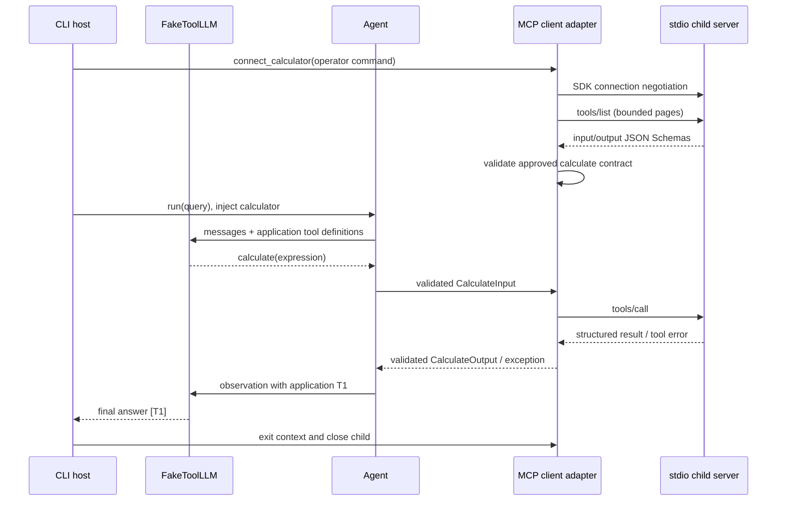

# Этап 9 — MCP

## Задача и выбор

Раньше агент вызывал Python-калькулятор напрямую. Теперь его можно опубликовать
как инструмент отдельного MCP-сервера и использовать через клиентский адаптер.
Бизнес-логика AST/Decimal остаётся в tools/calculator.py; сервер занимается
протоколом, клиент — discovery, контрактом и преобразованием результата.

| Вариант | Преимущество | Цена |
| --- | --- | --- |
| Прямой Python-вызов | Минимальная задержка и простой lifecycle | Один процесс/язык, общий deployment |
| MCP stdio | Отдельный процесс, стандартный discovery, нет HTTP-порта | Host отвечает за запуск и остановку процесса |
| MCP Streamable HTTP | Независимый сервис для нескольких клиентов | Сеть, аутентификация, deployment, лимиты HTTP |

Выбран stdio и официальный Python SDK 2.2.0 (uv.lock), диапазон mcp>=2,<3.
SDK реализует протокол и управление транспортом; agent loop остаётся явным.
Используем актуальный Client/MCPServer API v2. Не смешивать его с примерами
ClientSession/FastMCP старой ветки v1.



Host — наше приложение, управляющее моделью, политикой и подключениями.
Client — сторона соединения с одним сервером. Server публикует capabilities.
LLM не говорит по MCP: она выдаёт tool call в формате model API; приложение
проверяет аргументы, выбирает разрешённый адаптер и вызывает MCP.
В SDK v2 negotiation выбирает поддерживаемую версию протокола; её не хардкодим.

## Инструменты, ресурсы и промпты

- Tools — вызываемые операции со схемами аргументов и результатов. Здесь calculate.
- Resources — адресуемые данные, которые host может читать для контекста.
- Prompts — именованные шаблоны сообщений с параметрами, которые host может получить.

Серверу не обязательно реализовывать все три. На этом этапе resources/prompts
объяснены, но лишние демонстрационные endpoints не добавлены. Наличие MCP
не обеспечивает авторизацию или защиту от prompt injection. Remote descriptions,
результаты и instructions нельзя автоматически превращать в system instructions.

## Границы клиента

Поддерживается внешний stdio-сервер с инструментом calculate, совместимым с нашим
CalculateInput/CalculateOutput. Команда задаётся оператором через --server,
не моделью. Другие tools игнорируются. Схемы проверяются строго, за исключением
полей title и отсутствующего SDK additionalProperties:false у входной схемы;
сами аргументы всё равно локально валидируются со strict=True, extra=forbid.
Произвольный сервер с иной схемой потребует отдельного явного адаптера.
Описания сервера и prompts не попадают в модель; используются наши определения.

Результат должен содержать ровно expression/value/precision, совпадающее выражение,
precision=28 и конечное Decimal-значение допустимой величины. Проверка схемы
не доказывает правильность арифметики сервера. Текстовые блоки не используются
в качестве запасного результата; нужен structured_content без is_error.
Локальный калькулятор продолжает отдавать invalid_arithmetic, MCP-ошибки —
обобщённый tool_unavailable. Не выводим произвольные remote errors модели.

По умолчанию: timeout 5 s, max_pages 4, max_tools 32, discovery 32768 bytes,
result 4096 bytes. Нет автоматических клиентских повторов; действуют существующие
лимиты/кэш успешных вызовов агента. Cancellation не превращается в Observation.
SDK управляет stderr и shutdown grace period. Проверки размера выполняются после
декодирования; жёсткий memory/CPU/wire cap требует OS/container/transport isolation.
Сервер — доверенная исполняемая программа с правами пользователя. Не передавать
ему .env или полный os.environ. SDK применяет собственный минимальный stdio env.

## Запуск и проверка

Из корня проекта:

```bash
UV_CACHE_DIR=/tmp/retrieval-proj-uv-cache uv sync --locked --inexact
UV_CACHE_DIR=/tmp/retrieval-proj-uv-cache uv run --no-sync python -m agentic_rag.mcp.demo '6 / 8 * 100'
UV_CACHE_DIR=/tmp/retrieval-proj-uv-cache uv run --no-sync pytest tests/unit/test_mcp.py tests/integration/test_mcp_stdio.py
```

--inexact сохраняет уже установленные optional embeddings. Для нового окружения,
если нужны retrieval-модели, используйте uv sync --locked --extra embeddings.
В данном sandbox async/subprocess проверки выполняются с разрешением вне sandbox.
Demo использует настоящий Agent и протокол, но fake LLM. Ожидается answered,
один tool call, value=75.00 и [T1]. PostgreSQL/Qdrant и ключи не нужны.
API /agent пока сохраняет локальный калькулятор. Для MCP-приложения соединение
открывают/закрывают в одной async-задаче и передают calculator в Agent.
HTTP transport, OAuth и произвольный динамический registry не реализованы.

## Вопросы для обсуждения

1. Чем native tool calling модели отличается от MCP tools/call?
2. Почему tools/list не должен автоматически разрешать все обнаруженные инструменты?
3. Что меняется в lifecycle при переходе со stdio на Streamable HTTP?
4. Чем отличаются transport error, is_error и ошибка проверки structured result?
5. Почему наши byte budgets не гарантируют предел памяти MCP-процесса?

## Источники

- [Official SDK v2](https://py.sdk.modelcontextprotocol.io/)
- [Client, discovery, structured results](https://py.sdk.modelcontextprotocol.io/client/)
- [Tools](https://py.sdk.modelcontextprotocol.io/servers/tools/)

Описание реализации относится к установленному SDK 2.2.0; online docs могут меняться.
