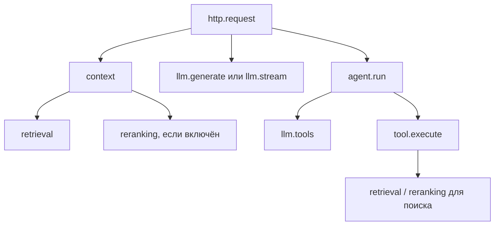

# Этап 11 — наблюдаемость

Реализованы локальные JSON spans, метрики и адаптер Langfuse SDK 4.15.4.
Локальный Langfuse 4.38.0 запущен через отдельный Compose-проект. Проверены
серверная доставка 3 трасс/14 observations, parent IDs, error levels и отсутствие
input/output через Observations API v2. Вход в UI и страница трассы дают HTTP200;
визуальный browser screenshot не делался. Есть также тест SDK с in-memory exporter.
После включения Docker запущены существующие PostgreSQL/Qdrant; 63 проверки
observability, API и реальных хранилищ прошли. Данные рабочих сервисов сохранены.

## Зачем и как

Лог — запись события. Метрика — агрегат, например число ошибок или гистограмма
задержек. Трасса — связанное дерево интервалов работы одного запроса. Для него
мы генерируем trace ID и отдельные span ID; parent ID задаёт дерево.

Варианты: логировать только итог запроса; подключить автоматические callbacks;
явно отметить границы операций. Выбран последний вариант: видно, какие действия
измеряем, можно проверить родительские связи и контролировать поля без сериализации
всей истории агента. LangGraph callbacks не подключены. Langfuse использует отдельный
OTEL TracerProvider, не глобальный provider других библиотек.



Это дерево типов операций; в одном агентном запросе LLM/tool шаги повторяются.
Retrieval включает получение кандидатов/гидратацию выбранного retriever, reranking
включает scoring и последующую гидратацию. Context включает весь построитель контекста
и ожидание worker-потока. Отдельных spans на SQL-запрос, embedding или Qdrant RPC нет.
`tool.execute` охватывает обработку предложения, в том числе cache hit и ошибки
валидации внутри `_execute`; это не точный счётчик внешних исполнений. Отклонённый
до `_execute` malformed batch не создаёт tool spans; остаются model proposal count
и итоговые счётчики/статус агента. Для детального разбора нужен evaluation trace.

ContextVar переносится в задачи и AnyIO worker threads. Middleware написан на ASGI
и живёт до конца response body, включая streaming, а не только до возврата объекта
StreamingResponse. При отключении клиента spans завершаются с cancelled, при
SSE-ошибке — error, даже если HTTP 200 уже отправлен. Новые trace ID генерируются
локально; входящие traceparent/X-Trace-ID не принимаются. Межпроцессная пропагация
до MCP/LLM/БД пока не реализована.

## Записываемые данные

Разрешены имена этапов, trace/span/parent IDs, duration, статус, ограниченные имена
маршрутов/методов/tools, количество кандидатов/источников/шагов/предложений,
repair/cached, безопасные коды/типы ошибок, finish reason и token usage.
Нет prompts, аргументов tools, содержимого документов, ответов, reasoning, ключей,
URL источников или строк исключений. Это политика новых spans, не универсальный
фильтр всего Python logging: сторонний logger или `logger.exception` всё ещё может
записать переданные ему данные. Новая инструментализация так не делает.

Langfuse получает metadata и usage_details без input/output. Стоимость не вычисляем;
валюта прежнего provider_cost не установлена. Отсутствие usage не равно нулевому
расходу: метрика unknown увеличивается, token counters складывают только известные
числа. У fake-моделей usage неизвестен. В тесте с 10/5 токенами числа заданы fixture,
это проверка переноса, а не измерение настоящей модели.

## Включение

По умолчанию observability и экспорт выключены. В существующем окружении:

```bash
RAG_OBSERVABILITY_ENABLED=true UV_CACHE_DIR=/tmp/retrieval-proj-uv-cache \
  uv run --no-sync uvicorn agentic_rag.api.app:create_app --factory \
  --host 127.0.0.1 --port 8001 --log-config config/logging.json
```

Для экспорта дополнительно задать `RAG_LANGFUSE_ENABLED=true`,
`RAG_LANGFUSE_BASE_URL`, `RAG_LANGFUSE_PUBLIC_KEY`, `RAG_LANGFUSE_SECRET_KEY`.
Ключи не добавлять в Git и не передавать в сообщения/команды. `.env` не менялся.
SDK создаётся при startup; закрывается при shutdown в worker thread с cancellation
shield. Ошибки экспорта не меняют результат запроса; события могут потеряться.
SDK буферизует/экспортирует асинхронно, это не гарантированная доставка. Timeout
5 секунд у SDK не является общим жёстким пределом shutdown или RSS.

API возвращает `X-Trace-ID`; JSON-логи содержат тот же trace_id и текущий span_id.
`config/logging.json` включает INFO для приложения и JSON formatter; обычный
запуск Uvicorn без этой конфигурации может не выводить наши INFO spans. Access logs
в этой конфигурации выключены; метод, известный маршрут и HTTP status есть в span.
После серверной настройки найти ID в Langfuse и сверить дерево, duration, usage и
ошибку. Наличие локального span или успешный flush не доказывает появление в UI.

`GET /metrics` отдаёт Prometheus text, когда observability включена (иначе 404).
`rag_span_duration_seconds` — histogram по конечному набору name/status;
`rag_llm_tokens_total` — известные input/output tokens;
`rag_llm_usage_unknown_total` — модельные интервалы без полного usage.
Trace IDs, запросы и source IDs не входят в labels. Endpoint не трассирует себя.
Счётчики локальны процессу и сбрасываются при перезапуске; multiprocess aggregation
и Prometheus deployment не добавлены. Гистограммы используют фиксированные buckets;
это не измерение точного p95. `/metrics` использует ту же модель доступа, что API,
отдельной аутентификации пока нет.

## Локальная проверка

```bash
UV_CACHE_DIR=/tmp/retrieval-proj-uv-cache uv run --no-sync python \
  -m agentic_rag.observability.demo --output artifacts/observability_NEW
```

Демонстрация использует ASGI без TCP, небольшой in-memory корпус, настоящий BM25,
production context/reranking orchestration, fixture scoring и fake-модели.
Она не открывает БД/векторный сервис/Langfuse и не загружает модели.
В `artifacts/observability_20260921/` сохранены 24 spans и 5 запросов:
RAG, агентный поиск, калькулятор, streaming success и streaming failure.
Последняя трасса имеет status=error при HTTP 200; это ожидаемая семантика SSE.
Файлы: spans.json, requests.json, metrics.txt. Они локальные и не входят в Git.

Проверены параллельные запросы и parentage через thread boundary, cleanup после
отмены, ASGI disconnect 2.3/2.4, ошибки экспорта, privacy полей, token accounting,
настоящий Langfuse SDK с in-memory exporter и полный demo. Это не серверный E2E
Langfuse и не performance/quality benchmark.

## Для интервью

- Объяснить различие события, агрегата и дерева операций.
- Почему request latency не равна сумме spans с перекрывающимися интервалами.
- Как ContextVar работает с async tasks/thread offload, и почему ASGI span должен
  охватывать итерацию streaming body.
- Почему неизвестный usage нельзя приравнять к нулю, а fake usage — к измеренному.
- Почему trace ID подходит для поиска логов, но плох как label метрики.
- Как отказ экспорта, sampling и перезапуск влияют на полноту наблюдений.

## Вопросы для обсуждения

1. Что выяснить из трассы медленного запроса, чего не видно из одной метрики latency?
2. Почему trace ID нельзя помещать в labels Prometheus?
3. Как HTTP 200 может сочетаться с ошибкой запроса в streaming-трассе?
4. Почему неизвестный token usage нельзя учитывать как ноль?
5. Что потеряем при отказе Langfuse и почему запрос при этом должен продолжать работать?

Источники: [SDK overview](https://langfuse.com/docs/observability/sdk/overview),
[manual instrumentation](https://langfuse.com/docs/observability/sdk/instrumentation).
Конкретные сигнатуры проверены по установленному SDK 4.15.4.

## Локальный сервер через Docker Compose

Подготовлен отдельный стек `compose.langfuse.yaml`, project name `retrieval-langfuse`.
Он использует собственные PostgreSQL, ClickHouse, Redis и MinIO и не меняет volumes
основного RAG. Web привязан к localhost:3000, S3 к localhost:9090, остальные порты
не публикуются. Telemetry Langfuse выключена. Это локальная учебная установка.

Первый запуск (из корня проекта):

```bash
python3 scripts/init_langfuse.py
docker compose --env-file .env.langfuse -f compose.langfuse.yaml up -d
```

Init создаёт `.env.langfuse` с mode 600, отказывается перезаписывать файл и не
печатает значения. Файл игнорируется Git. Обычный `.env` не меняется. Учётная запись
создаётся через headless initialization: `local@example.com`, пароль находится
в `LF_LOGIN_PASSWORD` в `.env.langfuse`; проект `retrieval-rag` (Agentic RAG).

При повторном запуске нужен только `docker compose ... up -d`. Остановка:

```bash
docker compose --env-file .env.langfuse -f compose.langfuse.yaml stop
```

Проверка реальной доставки (fake-модели, без платных запросов):

```bash
UV_CACHE_DIR=/tmp/retrieval-proj-uv-cache uv run --no-sync python scripts/check_langfuse.py \
  --output artifacts/langfuse_server_NEW
```

Скрипт отправляет три трассы через установленный SDK из ASGI-приложения, затем
проверяет сохранённые observations через authenticated public API: имена, parent IDs,
error level и отсутствие input/output. Печатает только trace IDs и ссылки.
Ожидает асинхронную обработку worker, а не считает flush доказательством доставки.
Для v4 используется `/api/public/v2/observations` с traceId и ограниченным временем;
legacy `/api/public/traces/{id}` для этих новых данных возвращает 404.

Для экспорта обычного API добавить к описанному запуску Uvicorn:
`--env-file .env.langfuse` (это загрузка окружения процесса; основной `.env` Settings
продолжит читать для существующей БД/LLM). Флаги и ключи берутся из отдельного файла.

Основа: [официальный Compose](https://langfuse.com/self-hosting/deployment/docker-compose)
и [headless initialization](https://langfuse.com/self-hosting/administration/headless-initialization).
Образ MinIO из cgr.dev вернул 403, Docker Hub minio/minio оказался недоступен;
использован официальный quay.io/minio/minio RELEASE.2025-09-07T16-13-09Z.

Серверная проверка 2026-09-21: `artifacts/langfuse_server_20260921_v2/verified.json`
и `local_spans.json`. RAG — 5 observations, агентный поиск — 7, ошибка — 2.
Первый проверочный прогон сохранён отдельно: он отправил трассы, но читал устаревший
API и завершился 404. Повтор исправил только readback endpoint. Все модели fake.
Health: 200 / version 4.38.0. Credentials login подтверждён через session API,
страница агентной трассы возвращает 200 без login redirect.

При проверке root span исправлен нюанс SDK: передача только trace_id создаёт
синтетического незаписанного parent. Теперь root создаётся в пустом OTEL context,
приложение принимает его trace_id, дочерние spans получают явные trace/parent IDs.
Unit test требует parent=None у root; серверный readback проверяет всё дерево.
Образы Compose закреплены digest загруженных образов. `.env.langfuse` хранит только
новые локальные credentials, не копию основных LLM/БД ключей.
