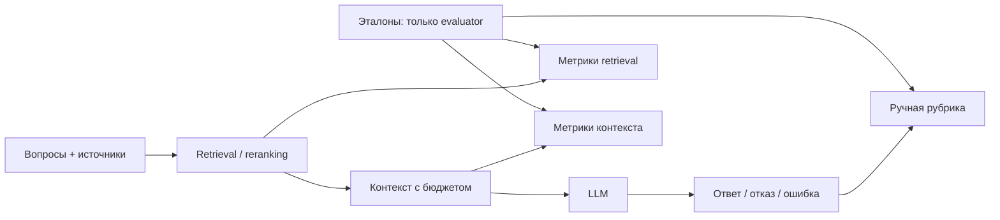

# Стадия 6 — оценка RAG

Реализованы отдельный версионированный набор `benchmarks/rag_v1`, команды
`evaluate-rag` и `review-rag`, метрики retrieval/контекста и ручная оценка ответов.
Рабочий RAG стадии 5 остаётся генератором ответов; эталоны ему не передаются.
API, агенты, streaming, развёртывание inference и автоматический judge не добавлены.

## Почему несколько уровней

Ошибка поиска, потеря доказательства при упаковке и искажение имеющегося факта
генератором требуют разных исправлений. Одного финального балла недостаточно:



Правильность сравнивает ответ с вопросом и эталонными фактами. Faithfulness сравнивает
фактические утверждения с переданным контекстом. Правильное внешнее знание может быть
неподтверждённым контекстом; точный пересказ неправильного источника может быть faithful.
Проверка `[C1]` из стадии 5 проверяет идентичность ссылки, а не семантическую поддержку.

Варианты оценки: строковые эвристики, человек по рубрике, LLM-as-a-judge. Эвристики
чувствительны к перефразированию и языку; judge может ошибаться и реагировать на
инструкции в оцениваемом тексте. Для небольшого набора выбрана явная ручная рубрика.
DeepEval/RAGAS пока не добавлены: сначала фиксируем значения метрик и правила разметки.
Позднее judge нужно калибровать по независимым человеческим оценкам и хранить его
model/prompt/version; наличие библиотеки не делает оценку объективной.

## Данные и воспроизводимость

`rag_v1/dataset.json` ссылается на прежние 10 авторских заметок, фиксируя SHA-256
каждого файла. Старый `dense_v1/dataset.json` и его qrels не изменены. Чанкинг 400/60
сохраняет прежние revision/chunk IDs. 10 вопросов: 5 EN, 5 RU; 8 answerable, 2 без
ответа в этом корпусе. Два answerable-вопроса сравнивают LoRA/QLoRA по двум источникам.

Для каждого вопроса есть reference_answer и точные evidence-фрагменты. Loader
проверяет идентичности, checksum, уникальность ID, соответствие answerability списку
evidence и присутствие каждого фрагмента целиком хотя бы в одном чанке. Это проверка
согласованности, не доказательство правильности или полноты авторской разметки.
Вопросы без ответа имеют пустой evidence и текстовое объяснение ожидаемого отказа.
Отсутствие ответа во всём корпусе пока утверждает автор разметки, а не алгоритм.

Набор зафиксирован до измерений. Он авторский development-набор с неполными judgments,
ожидающий человеческой проверки. Нет held-out split, независимой проверки эталонов
или оснований обобщать результаты на другие документы. Не подстраивать разметку под
ошибки модели; содержательные изменения оформлять новой версией набора.

CLI сохраняет/реактивирует эти версии в PostgreSQL и при dense/hybrid индексирует их,
как существующий retrieval evaluator. Поиск ограничен документами набора. Ready/current
проверяется до, между запросами и после прогона; каждый возвращённый hit проверяется
по каноническому ID, revision, тексту и координатам. Конкурентную смену и возврат версии
между проверками целиком исключить нельзя; фактически использованные источники остаются
в отчёте. Общую пользовательскую БД не следует одновременно изменять во время замера.

## Детерминированные метрики

| Поле | Определение и знаменатель |
| --- | --- |
| recall@K | Доля найденных размеченных релевантных чанков; после optional reranking, до упаковки |
| precision@K | Число найденных релевантных чанков / K, включая незаполненные позиции |
| mrr@K | В случае — reciprocal rank первого релевантного чанка; среднее по вопросам |
| ndcg@K | Нормализованный discounted gain, прежняя реализация метрики |
| context_evidence_coverage | Доля размеченных evidence-фрагментов, полностью представленных в упакованном контексте |
| context_relevance | Число размеченных релевантных чанков / число реально переданных чанков |

У context_evidence_coverage единица разметки — evidence, у retrieval recall — chunk.
Overlap может дать несколько релевантных чанков на один evidence: метрики не обязаны
совпадать даже без потерь упаковки. Релевантность по qrels — приближение к семантической
полезности; неразмеченный фрагмент может быть полезным, а релевантный — содержать шум.

Для answerable-вопроса пустой контекст даёт coverage=0, relevance=null (знаменатель 0).
Для unanswerable все эти метрики null: relevant set пуст, искусственные 0/1 не ставятся.
Каждая агрегированная метрика содержит mean и count непустых значений; count может
различаться. Mean context_relevance нельзя интерпретировать без coverage и count.

Бюджет пока остаётся из стадии 5: сериализованные UTF-8 байты сообщений, **не токены**.
Точный tokenizer/chat-template бюджет требует конкретной обслуживаемой модели.

## Ответы, ошибки и ручная рубрика

Отчёт содержит все вопросы, эталоны, hits, фактический context/messages, ответ, raw_completion
при её получении, безопасный тип ошибки и время. Неудачи LLM не удаляются из выборки;
retrieval/ошибки целостности набора останавливают прогон. Незавершённый ответ с валидной схемой сохраняется через IncompleteCompletionError:
raw_completion содержит finish_reason и usage, но ответ всё равно отклоняется.
Невалидный wire JSON может не дать Completion. В первоначальном baseline старый
адаптер потерял метаданные одного незавершённого ответа; тот отчёт не изменяется. Ответ с
невалидными цитатами сохраняется в raw_completion, но не выдаётся как успешный answer.

Сохраняются конфигурация поиска, model spec эмбеддингов/reranker при использовании,
имя LLM, temperature/output limit/timeout, хеш system prompt, версии документов,
хеш dataset, timestamp и среда Python. Сами prompt сохранены по каждому случаю.
Имя обслуживаемой модели не фиксирует её веса: при реальном прогоне отдельно сохраните
revision модели, tokenizer/chat template и версию inference-сервера. Ключи доступа и
URL с учётными данными не записываются. Время retrieval включает optional reranking;
generation_workflow включает сборку prompt/валидацию. Это последовательный прогон,
не TTFT, throughput или нагрузочный benchmark; загрузка/индексация до цикла не измеряется.

`review-rag` без --annotations создаёт пустую форму. Она привязана к SHA-256 канонического
JSON всего отчёта. Переформатирование JSON допустимо, изменение ответов/настроек/времени
делает форму несовместимой. Хеш защищает от случайного смешения прогонов, не доказывает
авторство или неизменяемость намеренно подделанного отчёта.

Рецензент читает question, reference_answer, evidence, answer и context в report:

1. Указать reviewer; это имя/ID фактического рецензента, не выдуманный «human».
2. Для каждого случая без технической ошибки поставить correctness:
   - 0: неверный ответ, ключевое противоречие, ответ при отсутствии данных либо отказ
     на answerable-вопрос. Последний оценивается по всему корпусу, даже если контекст
     оказался недостаточным; такой отказ при этом может быть faithful.
   - 1: частично правильный ответ, упущены существенные факты, нет ключевого противоречия.
   - 2: корректный и достаточно полный ответ; для unanswerable — уместный явный отказ.
3. Объяснить оценку в rationale. Для answered разбить **все** фактические утверждения
   на отдельные claims, копируя уникальные дословные фрагменты ответа в text. Для
   каждого указать verdict: supported, unsupported или contradicted, и rationale
   со ссылкой на конкретное место контекста либо объяснением отсутствия поддержки.
   Поддержка оценивается по всему переданному контексту, не только по поставленной
   моделью метке. Точность привязки каждой цитаты отдельной метрикой пока не измеряется.
4. При недостатке оснований ставить unsupported; contradicted — при явном противоречии.
   Факты из внешнего знания не заменяют контекст. У структурированного отказа claims=[]:
   faithfulness не определяется, а не получает автоматическую единицу.

Форма должна покрывать все случаи без ошибок, запрещены дубли/неизвестные ID,
незавершённые оценки, неизвестные verdict, утверждения не из ответа. Код не может
проверить полноту ручного выделения утверждений или правильность judgment. На серьёзной
выборке потребуются независимые рецензенты, проверка согласованности и разрешение споров.

Сводка считает:

- correctness_all_cases_errors_zero = сумма correctness / (2 × все вопросы).
  Технические ошибки дают ноль; их количество показывается отдельно.
- faithfulness_micro = supported / все размеченные claims; null, если claims нет.
- unsupported_claim_rate = (unsupported + contradicted) / все claims.
  Это оценка неподдержанных утверждений, не доказательство их внешней ложности.
- contradiction_rate = contradicted / все claims; знаменатель общий, метрики вложены.
- abstention_accuracy_all_cases_errors_zero: доля совпадений структурированного
  отказа с corpus-level answerability; ошибки дают ноль. Это правильность решения
  отвечать/отказаться, а не правильность содержания ответа.

Faithfulness условна на успешных ответах с claims. Всегда читать её вместе с errors,
reviewed_count, claim_count и correctness; массовые отказы не должны выглядеть качеством.
Пока нет оценок, answer_quality=null. Fake-прогоны маркируются contract_smoke и
**не допускаются к вычислению семантического качества** даже с заполненной формой.

## Команды

С настроенным PostgreSQL, после `db-upgrade`, из корня проекта:

```bash
uv run --locked --extra embeddings agentic-rag evaluate-rag \
  benchmarks/rag_v1/dataset.json --mode bm25 --llm fake \
  --output artifacts/rag_bm25_fake.json

RAG_LLM_MAX_PROMPT_BYTES=2500 uv run --locked --extra embeddings agentic-rag evaluate-rag \
  benchmarks/rag_v1/dataset.json --mode bm25 --llm fake \
  --output artifacts/rag_bm25_fake_2500.json
```

BM25+fake не требует Qdrant или весов моделей. Extra сохраняет существующую установку.
Для настоящего локального сервера задать RAG_LLM_BASE_URL и RAG_LLM_MODEL, при необходимости
RAG_LLM_API_KEY, согласовать токенный бюджет и использовать --llm compatible.
Dense/hybrid поддерживают --collection-prefix, --candidate-k, --rerank, --rerank-k и --k:

```bash
RAG_MODEL_LOCAL_FILES_ONLY=true uv run --locked --extra embeddings agentic-rag evaluate-rag \
  benchmarks/rag_v1/dataset.json --mode hybrid --rerank --llm compatible \
  --collection-prefix rag_dense_v1 --output artifacts/rag_model.json

uv run --locked --extra embeddings agentic-rag review-rag artifacts/rag_model.json \
  --output artifacts/rag_review.json
# Заполнить rubric в rag_review.json после чтения полного rag_model.json.
uv run --locked --extra embeddings agentic-rag review-rag artifacts/rag_model.json \
  --annotations artifacts/rag_review.json --output artifacts/rag_quality.json
```

Выходные файлы создаются эксклюзивно: повторное использование пути — ошибка, старый
результат сохраняется. review-rag работает без БД/LLM. Успешное сохранение evaluation
отчёта даёт exit 0 даже при ошибках отдельных генераций: проверять поле errors.
Обычные ошибки конфигурации/разметки дают exit 2; инфраструктурные сбои — exit 1.

## Проверка знаний

1. Почему высокий retrieval Recall@K не гарантирует достаточного контекста?
2. Чем отличаются знаменатели chunk recall и evidence coverage при overlap?
3. Почему отсутствие ответа требует отдельного правила метрик, а не Recall=0?
4. Как одновременно получить высокую faithfulness и плохую correctness?
5. Как исключение ошибок и отказов из знаменателя может исказить оценку качества?

## Подключение Rus-GPT

Для выбранного пользователем сервиса `.env` задаёт:

```dotenv
RAG_LLM_BASE_URL=https://rus-gpt.com/api/v1
RAG_LLM_MODEL=qwen/qwen3.6-35b-a3b
# RAG_LLM_API_KEY — только в локальном .env, не в коммитах/отчётах.
```

Первый реальный запрос 2026-09-17 вернул HTTP 200, final content с [C1],
finish_reason=stop, usage и отдельные reasoning/reasoning_content поля. Существующий
адаптер принимает этот формат; reasoning-текст не добавляется к ответу и не
сохраняется им. Наличие таких полей показывает, что провайдер возвращает reasoning,
но не позволяет восстановить конфигурацию serving backend или revision весов.

Для первого 10-вопросного прогона оставлен серверный режим по умолчанию: отключение
thinking на стороне посредника не подтверждено. max_tokens поднят с 512 до 2048,
HTTPX timeout с 60 до 120 секунд на операцию, бюджет prompt оставлен 24000 байт.
Эти настройки передаются окружением для конкретного запуска; пользовательский .env
не перезаписывается. Лимит 2048 не гарантирует, что reasoning всегда поместится.

```bash
RAG_LLM_MAX_TOKENS=2048 RAG_LLM_TIMEOUT_SECONDS=120 RAG_LLM_MAX_PROMPT_BYTES=24000 \
uv run --locked --extra embeddings agentic-rag evaluate-rag \
  benchmarks/rag_v1/dataset.json --mode bm25 --llm compatible \
  --output artifacts/rusgpt_qwen36_repeat.json
```

Это платный внешний inference-сервис. Результаты относятся к данному API/model ID,
а не к проверенной локальной конфигурации vLLM. Реальный запуск не меняет требования
к ручной семантической проверке и не делает citation ID доказательством groundedness.


## Результат настройки и сравнения моделей

Проверен параметр `reasoning: {"enabled": false}` для Rus-GPT Qwen3.6.
Он доступен как `RAG_LLM_REASONING_ENABLED=false`; по умолчанию None — поле вообще
не посылается. Это расширение конкретного API, не универсальный стандарт:
другой сервер может отвергнуть или проигнорировать его. Два альтернативных формата
параметра были приняты Rus-GPT, но не отключили возврат reasoning.

Текущая локальная конфигурация: Qwen3.6, reasoning=false, max_tokens=4096,
timeout=120. Ключ и endpoint сохраняются в игнорируемом .env. В общем system prompt
теперь явно указано писать отдельные [C1] [C2], не [C1, C2]. Это новая версия prompt;
старые отчёты и их system-prompt hashes не меняются.

Completion дополнен provider_cost (единицы определяет провайдер) и числом символов
возвращённого reasoning, без самого reasoning-текста. Если поля reasoning отсутствуют,
нулевая длина не доказывает отсутствие внутреннего вычисления. Незавершённая Completion
остаётся ошибкой, но её токены/стоимость доступны evaluator. HTTP/невалидный JSON
по-прежнему могут не дать достоверного usage.

По просьбе пользователя выполнен разбор ассистентом. Формы теперь имеют
review_method=human|assistant (по умолчанию human для прежних форм); результаты
содержат метод и reviewer. Это маркировка происхождения, не сертификат независимости.
Correctness оценивает смысл текста; структурированная правильность отказа считается
отдельно. Например, смысловой отказ с лишним пояснением может быть корректным по
содержанию, но нарушать контракт sentinel.

Полное парное сравнение, все ответы, предварительные оценки и ограничения:
[model_comparison_v1](../benchmarks/rag_v1/results/model_comparison_v1/README.md).
Решение на текущем development-наборе — оставить настроенную Qwen; это не доказательство
её общего превосходства над Haiku. Независимый человеческий разбор ещё не выполнен.
